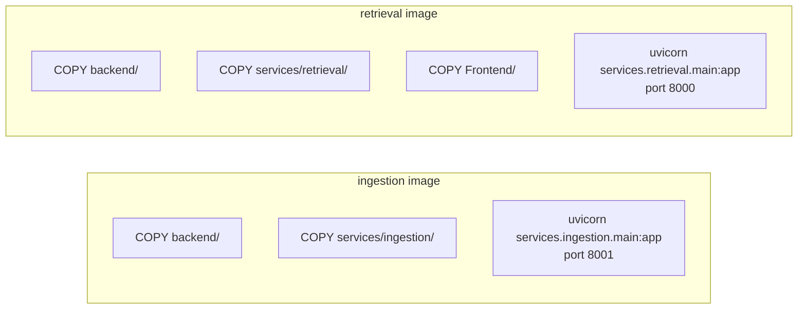
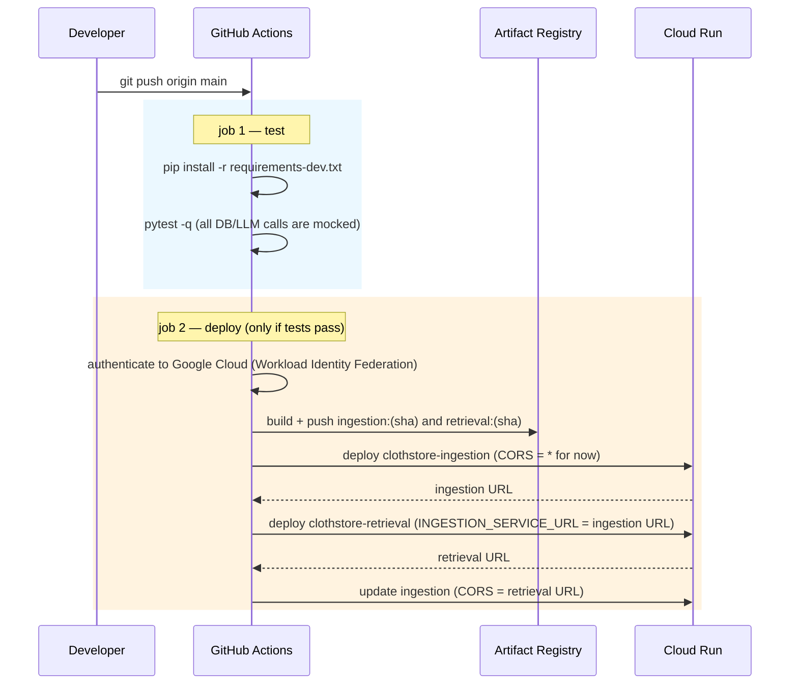

# 7 · Deployment

In production, ClothStore runs on **Google Cloud** as **two containers on Cloud
Run**, deployed automatically by **GitHub Actions** on every push to `main`.

For the step‑by‑step "set up the Google Cloud project" commands, see
[`commands.md`](../commands.md) in the repo root. This page explains *what* is
used and *why*.

## Google Cloud services used

| Service | What it does here |
|---------|-------------------|
| **Cloud Run** | Runs the two container images. Fully managed: no VMs to patch, scales up under load, scales to **zero** when idle (you pay per request). Each service gets a public HTTPS URL. |
| **Artifact Registry** | A private Docker image store. The pipeline pushes `ingestion` and `retrieval` images here, tagged with the Git commit hash, in a repository called `clothstore` in region `us-central1`. |
| **IAM – Workload Identity Federation** | Lets GitHub Actions prove its identity to Google Cloud **without a stored key**. GitHub's short‑lived OIDC token is exchanged for a short‑lived Google access token at deploy time. Nothing secret is kept in the repo. |
| **IAM – Service Account** | The identity the deploy *acts as*. It needs three roles: **Cloud Run Admin** (deploy services), **Artifact Registry Writer** (push images), **Service Account User** (let Cloud Run run as itself). |

**APIs to enable** on the project: `run.googleapis.com` (Cloud Run),
`artifactregistry.googleapis.com` (Artifact Registry), `iamcredentials.googleapis.com`
and `sts.googleapis.com` (for the token exchange).

> **Not used:** Cloud Build — images are built on the GitHub Actions runner with
> plain `docker build`, not in Google Cloud. No Cloud Storage, Cloud SQL, or VMs.

**MongoDB Atlas is not a Google Cloud service.** It is a managed database from
MongoDB Inc. (it *can* run on Google's infrastructure, but you manage it through
the MongoDB dashboard). The app reaches it over the internet using `MONGO_URI`.

## The two container images

Both are built from the repo root, both start from `python:3.11-slim`, both
install `requirements.txt`.



The `retrieval` image also bundles `Frontend/` because that service serves the
storefront. The `ingestion` image doesn't need it.

## The pipeline

`.github/workflows/cicd.yaml`, triggered by a push to `main`:



### Why deploy in that order

The storefront is served by **retrieval**, so when the browser sends a write
request to **ingestion**, that request comes *from retrieval's domain*.
Ingestion's CORS settings must allow that domain. But:

- retrieval needs ingestion's URL first (it hands it to the frontend via
  `GET /config`), and
- Cloud Run only assigns a service its URL *after* the first deploy.

So the pipeline: deploy ingestion with a permissive `ALLOWED_ORIGINS=*` →
deploy retrieval (now it knows ingestion's URL) → go back and tighten
ingestion's `ALLOWED_ORIGINS` to retrieval's real URL.

## Secrets the pipeline needs (GitHub → repo → Settings → Secrets)

| Secret | Purpose |
|--------|---------|
| `GCP_PROJECT_ID` | which Google Cloud project to deploy into |
| `GCP_WORKLOAD_IDENTITY_PROVIDER` | the Workload Identity provider resource name |
| `GCP_SERVICE_ACCOUNT_EMAIL` | the deploy service account |
| `MONGO_URI` | database connection (passed to both services + the test job) |
| `GROQ_API_KEY` | language‑model calls |
| `GOOGLE_CLIENT_ID` | Google Sign‑In |
| `LOGFIRE_API_KEY` | tracing (optional) |
| `PORTKEY_API_KEY`, `PORTKEY_GROQ_PROVIDER` | route model calls through Portkey (optional) |

## Running it yourself without Google Cloud

You don't need any of the above to run ClothStore. Two options:

```bash
# Monolith — one process, everything on port 8000
python main.py

# Split services — mirrors production, retrieval:8000 + ingestion:8001
docker-compose up
```

Both read configuration from a `.env` file (copy `.env.example`).
