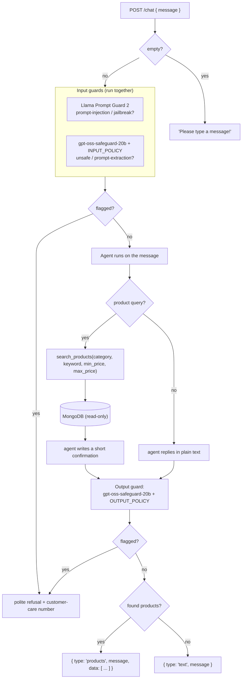

# The POC — how it works

The client, LUXE, runs an online clothing store (see the `01-store-only`
branch). They want customers to be able to *ask* for products in plain English
instead of clicking through category and price filters.

This POC proves that works, in isolation, against their real catalog — before
touching their codebase.

## The flow

All of this is one function: `run_chat(message)` in `app/chatbot/pipeline.py`.
It returns a plain dict and never raises. Guardrail calls **fail open** — if a
Groq call errors it is logged and the request continues, so a safety-model
hiccup never takes chat down.

## The pieces

| Piece | File | Job |
|-------|------|-----|
| **Agent** | `app/chatbot/agent.py` | A Pydantic AI agent on a Groq model with **one tool**, `search_products`, which builds and runs a MongoDB query and stashes the matches on a per-run object. |
| **Guardrails** | `app/chatbot/guardrails.py` | Llama Prompt Guard 2 screens the incoming message for injection; gpt-oss-safeguard-20b checks it against a policy, and checks the reply too. |
| **Pipeline** | `app/chatbot/pipeline.py` | `run_chat` — ties the above together into the response the UI renders. |
| **Gateway** | `app/utils/llm_gateway.py` | If `PORTKEY_API_KEY` is set, all Groq calls route through Portkey; otherwise they go direct. Behaviour is identical either way. |

## Models

All on Groq, all overridable via env vars:

| Setting | Default | Used for |
|---------|---------|----------|
| `AGENT_MODEL_NAME` | `openai/gpt-oss-20b` | the assistant |
| `PROMPT_GUARD_MODEL_NAME` | `meta-llama/llama-prompt-guard-2-86m` | injection detection |
| `GUARD_MODEL_NAME` | `openai/gpt-oss-safeguard-20b` | the policy checks |

## What integration adds (on the `main` branch)

- This `app/chatbot/` package, dropped into `backend/chatbot/` unchanged.
- A thin `POST /chat` route calling the same `run_chat`.
- The chat widget on every storefront page.
- **Evals** — live evaluators on every real chat, plus an offline suite.
- Full request tracing.
